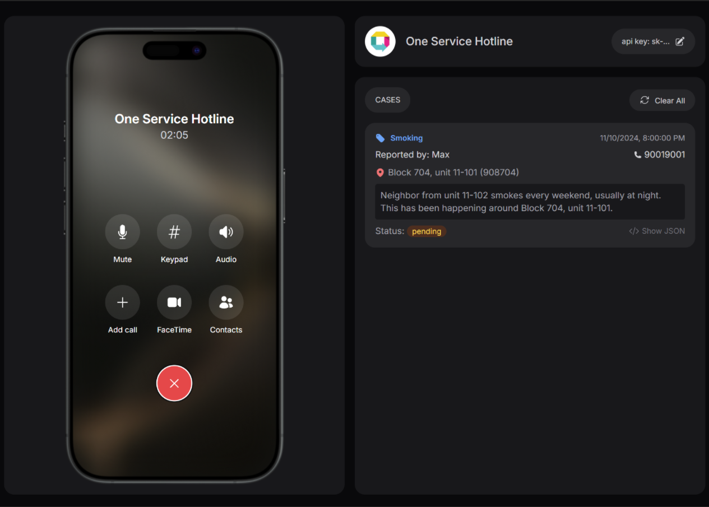
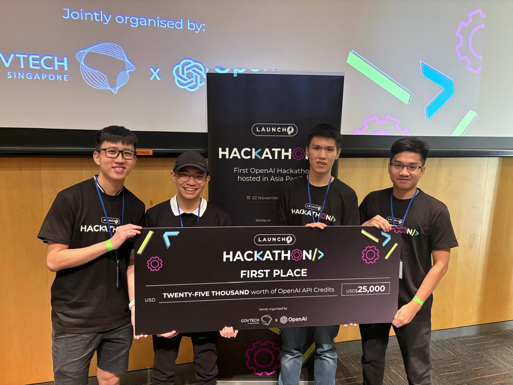
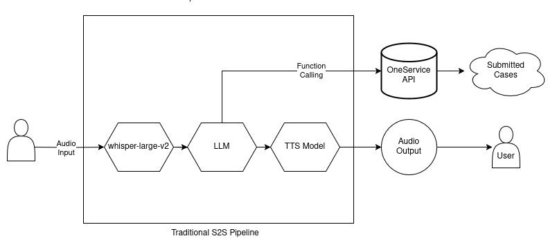
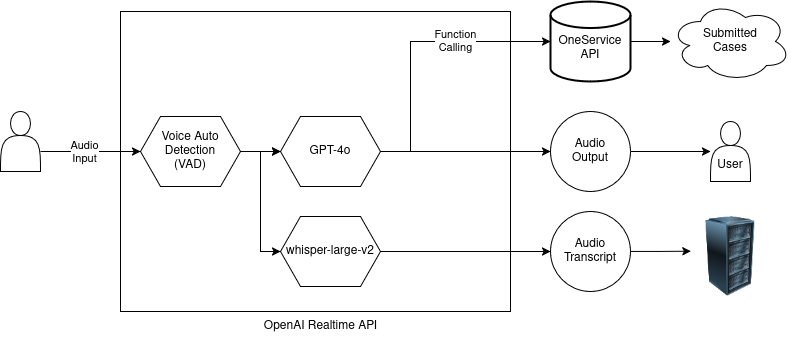

# **Oneservice Hotline v0.1**

Helpful AI assistant to submit cases on municipal issues.

###### First prize winner of GovTech x OpenAI Hackathon 2024
 

---

# About Us
Group of aspiring young engineers

-  [Ong Zheng Kai](https://www.linkedin.com/in/ong-zheng-kai)
-  [Wong Zhao Wu, Bryan](https://www.linkedin.com/in/zw-wong/) (looking for Summer Intern 2025!)
-  [Oh Tien Cheng](https://www.linkedin.com/in/ohtiencheng)
-  [Muhammad Faqih Akmal](https://www.linkedin.com/in/faqih-akmal/)

---

# Problem Statement

How might we enable **elderly users** in submitting **municipal cases or feedback** without requiring them to navigate the OneService App, which can be challenging due to **limited digital literacy**?

---

# Existing Platform

- The OneService App & Chatbot is a one-stop platform that lets citizens feedback on municipal issues.
- Perfect for majority of citizens.

https://www.smartnation.gov.sg/initiatives/oneservice-app/

---
# The Average Elderly

- Has a smartphone, but not technologically savvy.
- Has a lot of feedback to improve the community.
- Loves to call their friends

---

# Our Solution

A **speech-to-speech** AI hotline that can be used to assist the caller in **filing OneService cases** in multiple Singapore spoken language using **OpenAI's Realtime API**.

---

# Demo

- [English Demo](https://youtu.be/ojxzHv3ontM)
- [Chinese (Hokkien) Demo](https://youtu.be/WAeEP51iHIY)

---

# Speech-to-Speech Pipeline

- [ audio input ] ➔ [ ASR/SST ] ➔ [ GPT4 ] ➔ [ TTS ] ➔ [ audio output ]

---
# Speech-to-Speech Pipeline: Common Challenge

- Higher Latency
- Lack of context for tone and emotions in text
- NLP challenge like phrase endpointing (*figuring out when the LLM should respond*), and interruption handling
- Robotic output from TTS models

---

# OpenAI's Realtime API
- Uses GPT-4o for native audio and text token ingestion and generation.
- Uses Stateful WebSocket or WebRTC session with event-based communication protocol.
    - client-sent events to update the state of session (`input_audio_buffer.append`, `response.create`)
    - listen server-sent events to received updates (`response.audio.delta`, `response.done`)
- Supports function-calling / structured output.

---

# What audio-to-audio solves?

- Lower latency
- Easier model interruption (stop model from thinking immediately such that no extra information is added into the context length)
- More realistic voice

---

# More About Realtime sessions

- Server-side context management.
    - Uses client-sent event to update the remote conversations (i.e. LLM's context)
    - Save bandwidth by not sending audio-buffer repeatedly
- Maximum session length of 30 minutes.
- Supports creating of response outside of default conversation.

---

# Realtime API: GPT-4o

---

# Voice Activity Detection

- Two-mode of audio inputs: Press-to-talk or VAD
- VAD will analyse audio stream and determine if the user has stopped speaking or has interrupted the model

---

# Function Calling

- Developer can define `Functions` which is tools available for LLM to call to accomplish their tasks.
- Description for each fields can be used by LLM to steer conversations.

---

# Speech-to-Text Model

- Realtime API uses `whisper-large-v2` to transcribe input audio stream asynchronously.
- Transcription is not used by LLM but serves as "representation" understood by the model.

---

# What Works Well?

- GPT-4o **understands Singapore languages and dialects** (*Singlish, English, Mandarin, Hokkien, Teochew, Cantonese*) well enough to submit case reliably.
- GPT-4o orchestrated the workflow with just **25 lines of instruction prompting** (without complex agentic workflow).

---

# What Doesn't work?
- Voice Activity Detection (VAD) is not reliable in loud environments with multiple speakers in background.
- Default Whisper doesn't work reliably with Singlish (*when different languages mixes*).
- Stateful server interaction of Realtime session with maximum duration of 30 minutes.

---
# Challenge: Singlish is "cha-ba-lang"
- Multiple languages in a single conversations.
- Lack of fully localised **multilingual** whisper implementation (Singlish + Other dialects at same time)

[ Source: [Renae Cheng.](https://thesmartlocal.com/read/singaporean-culture-quirks/) ]

---

# What's Next

---

# Reflection

---

# Thank You
